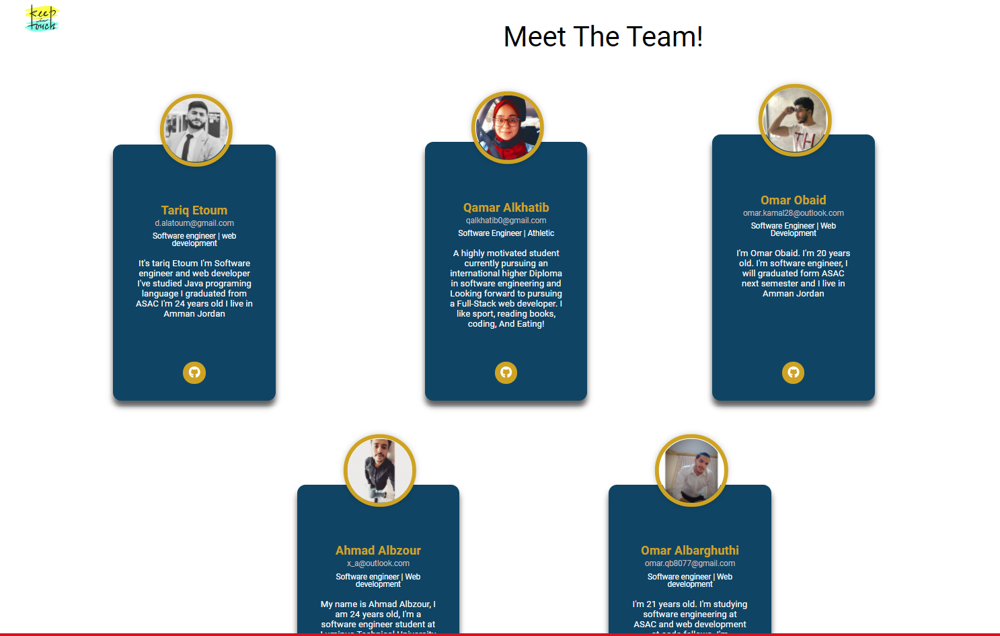
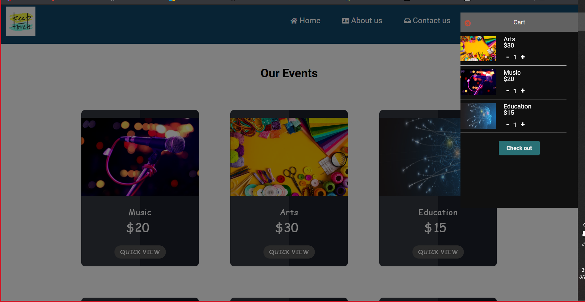

# Stage two 

## 1) presentation 

**you can find the power poient in the submitted files:** 

## 2) final project 
[GitHub repo](https://github.com/KEEP-N-TOUCH/KEEP-N-TOUCH)

[live url](https://keep-n-touch.github.io/KEEP-N-TOUCH/)

## 3) Feed back edits 

for this stage we had 4 feedbacks from our colleagues and instructors.

 * sold home page:

**we added some animations and some coloers**

* we should add company logo 

**we solved this feed back by adding the company logo on every single page in our website**

* we should have the same NavBar for all pages

**we solved it by having the same NavBar for all the pages**

* to have the social media icons 

**we added the icons for every page in our project**

## improvments 

* we should have the same text font size and text align 
 * cart page 

**we added it by having the same font family and text size for all the pages**

## improvments that we didn't do yet 
* cart checout 

* video background 

* slide show 

<!-- feedback edits  -->
# ***Feedback Part 2.3***

## why we choose these improvments 
* we choosed the first one and **(it was having the same font family and text size)**  to make the website design and styleing look. much better 
* for the second one **(it was cart checkout )** choosed this one to make the website more realistic and interactive.
* for the third one video **(it was adding background video )** we added this one to make the website design and styleing look. much better.
* for the fourth one **(it was adding slide show )**  for this one we will use it to show our events in more attractive way for the user.

<!-- feedback End -->
# stage three 

**fot the testing part:** 
we **used black-box** testing **not white-box** testing
and now I'll clarify these testing methods
  

## Black Box Testing

 

**Black Box Testing:** is a software testing method in which the functionalities of software applications are tested without having knowledge of internal code structure, implementation details and internal paths. Black Box Testing mainly focuses on input and output of software applications and it is entirely based on software requirements and specifications. It is also known as Behavioral Testing.

### Black Box Testing Techniques:

* **Equivalence Class Testing:** It is used to minimize the number of possible test cases to an optimum level while maintains reasonable test coverage.
* **Boundary Value Testing:** Boundary value testing is focused on the values at boundaries. This technique determines whether a certain range of values are acceptable by the system or not. It is very useful in reducing the number of test cases. It is most suitable for the systems where an input is within certain ranges.
* **Decision Table Testing:** A decision table puts causes and their effects in a matrix. There is a unique combination in each column.

[source used](https://www.guru99.com/black-box-testing.html)

 

## White Box Testing

 

**White Box Testing:** is software testing technique in which internal structure, design and coding of software are tested to verify flow of input-output and to improve design, usability and security. In white box testing, code is visible to testers so it is also called Clear box testing, Open box testing, Transparent box testing, Code-based testing and Glass box testing.

### White Box Testing Techniques

* **Statement Coverage:-** This technique requires every possible statement in the code to be tested at least once during the testing process of software-engineering.
* **Branch Coverage** – This technique checks every possible path (if-else and other conditional loops) of a software application.

[source used](https://www.guru99.com/white-box-testing.html)

    

## 1)applying the requirements
## a) HOME BUTTON 

## b) about us page 

## b) cart page 

## 2)negative impacts 
 

 * Code quality 

 **we had a check sessions to make sure that the code was clear enough to readable code and reusable**
* Time management. 
 **for this one we used to use GitHub project tools to follow the time line and not to be late**
* Code conflicts. 
 **we solve this one by following the instructions step by step to solve the conflict**
* Not ready to use the Available tools. 
 **at the first we struggled in this one but we saw many videos and tutorials to know more about the tools**
* Changing the plan many times.
 **we draw wireframe and follow this wireframe**
* We faced a problem with the code in some points. 
 **we stuck in the code  and we asked for the teachers assistant**
* the most important thing is the compant don't want to confuse their customers by changing the regular work to use the website. 
 **we added a simble guide to the users to make it easier for them**
* we were strugling with the compant with the website desgin.
 **also, in this poient we follow the wireframe that we draw before**

 ## 3) the strengths and weaknesses 

 ### a) strengths 
 * we used the local stoage to save the user data 
 * our website is realy sibmle and easy use 
 * our cart it's in the same and the user can control it from the cart table so not to confuse the user 

### a) weaknesses 
* we don't have login page 
* cart cheackout not ready
* we didn't use a lot of animations 

