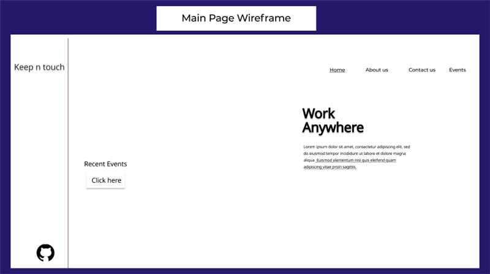
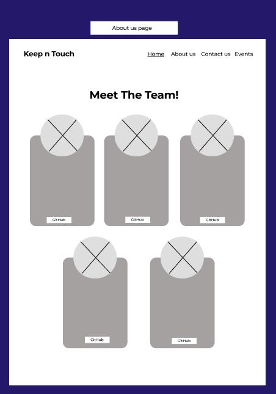
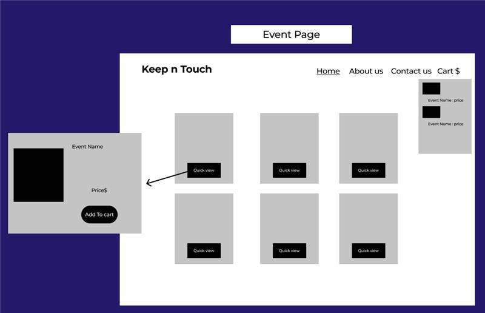
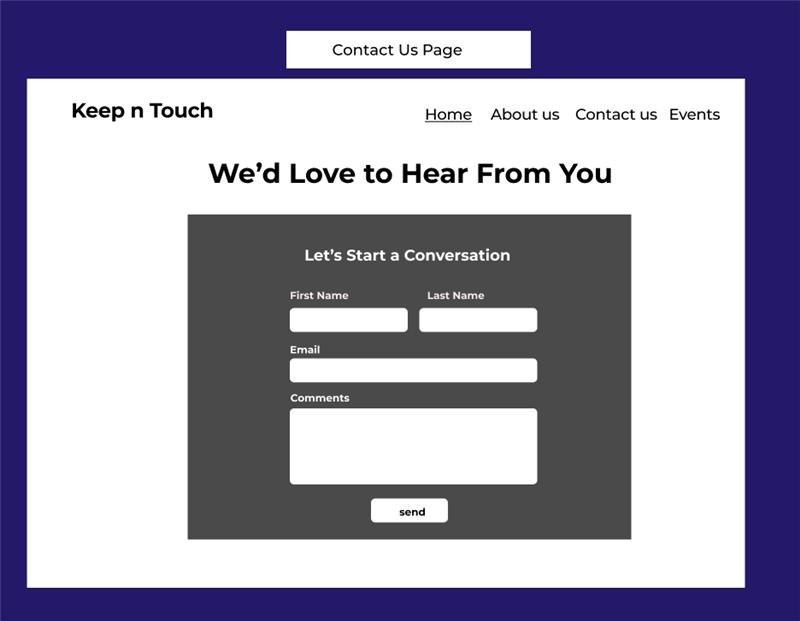
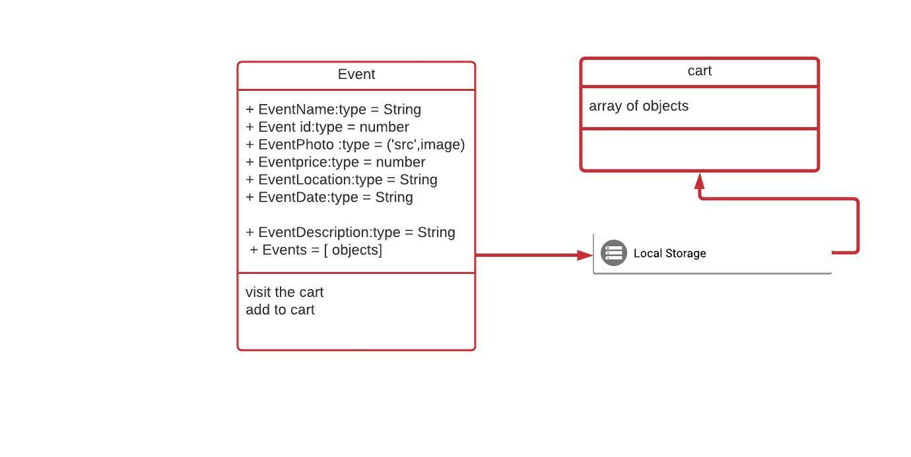
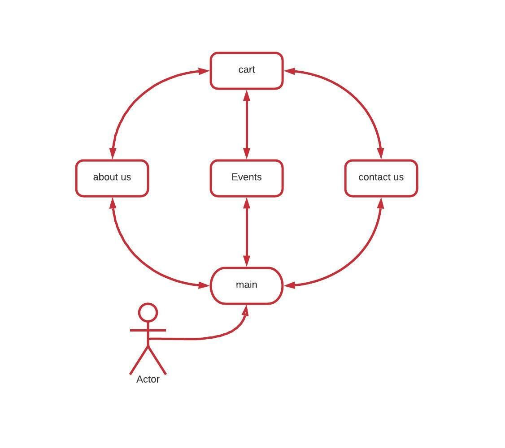

**We have very simple home page contains only text animation in the middle and company logo and GitHub icon for the Organization. Also, we have many taps we will talk about them after the home page.**  
     

**the user can show the developers details and visit their Git Hub and our Emails by “About Us” page.**  
     

**Now let us talk about Event page this page contains many events to pick from.If the user press on any “quick view button” the event details will pop up for him.      After that,If the user like any of the website events he can buy ticket for this event By pressing “add to cart”.**  
     
**if the user have any feedback for us he can simply send it to us by “contact us” page and filling the form**  

     

**for the database design. we only have one Object but this object had many attributes in this image we clarify the object Name (Event) and its attributes also we won't forget the data-types  and we connect this object to the local storage as we can see in this image**  
     

**for the Activity Diagram: after the user enter to our website we will find himself in the home page from the home page he can move to all the taps that's why we conecct them together**
